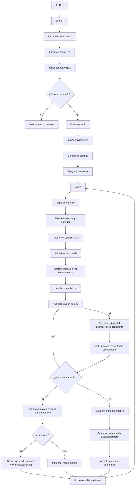
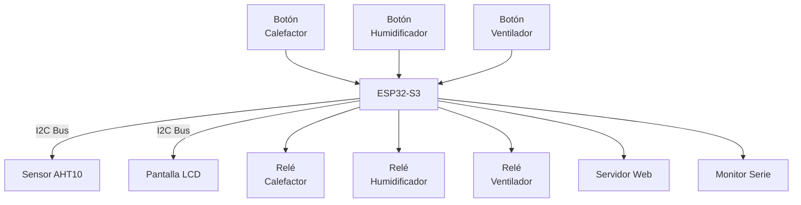


# Informe Proyecto: Control de Invernadero 

**Autor:** Alicia Varón López y Lulu Armoire Palomar 
**Fecha:** 25 de junio del 2025


## Descripción del proyecto

### Funcionamiento del sistema
Este proyecto consiste en el desarrollo de un sistema de control automático y manual para un invernadero, utilizando un microcontrolador ESP32-S3 . Este lo que hace es medir la temperatura y la humedad a través de un sensor digital AHT10 (conectado por I2C). Los valores leídos se visualizan en una pantalla LED y, en función de estos valores, se controlan tres actuadores:

- Calefactor
- Humidificador
- Ventilador


ajustando los actuadores según los umbrales definidos de temperatura y humedad, o en modo manual mediante tres botones físicos, uno para cada actuador: calefactor, humidificador y ventilador.

Cuando se pulsa un botón, el actuador correspondiente cambia de estado (ON/OFF) y entra automáticamente en modo manual, lo que significa que a partir de ese momento el sistema ya no lo controla automáticamente, y respeta la decisión del usuario.

Sin embargo, el sistema monitoriza continuamente las condiciones ambientales. Si detecta que el estado manual de un actuador coincide con lo que haría el sistema en modo automático, entonces desactiva el modo manual para ese actuador, devolviéndolo al control automático de forma transparente.

Esta configuración permite que el sistema:

-   Priorice la acción manual del usuario cuando sea contraria al modo automático.
    
-   Recupere el control automático solo cuando ambos modos coinciden.
    

Por ejemplo:  
Si el calefactor está en modo manual y encendido porque el usuario así lo indicó, pero la temperatura sube por encima del umbral, no se apagará automáticamente. Solo cuando la temperatura vuelva a bajar por debajo del umbral (y coincida con el estado actual del calefactor) el sistema considerará que puede volver al modo automático.

Además, el sistema ofrece una interfaz web accesible por WiFi, desde la que se pueden visualizar en tiempo real la temperatura, la humedad y el estado de cada actuador, así como si están en modo automático o manual.


### Materiales Utilizados
| Componente               | Descripción                          |
|--------------------------|--------------------------------------|
| ESP32-S3                 | Microcontrolador principal           |
| Sensor AHT10             | Sensor de temperatura y humedad (I2C)|
| Pantalla LED "      | Interfaz visual para datos (I2C)     |
| 3 botones físicos        | Control manual de los actuadores     |
| Calefactor (Relé 1)               | Actuador térmico                     |
| Humidificador (Relé 2)           | Actuador para aumentar humedad       |
| Ventilador (Relé 3)               | Actuador para ventilación            |
| Protoboard         | Para realizar conexiones físicas     |
| Cables dupont            | Cableado general                     |
| Fuente de alimentación   | 5V USB o adaptador para la ESP32     |


### Conexiones y pines utilizados
Estos son los pines que configuramos en la ESP32-S3 para conectar los sensores, botones y actuadores. Los pines pueden adaptarse según las necesidades del diseño físico.

| Componente              | Pin ESP32-S3 |
|-------------------------|--------------|
| Sensor AHT10 - SDA      | GPIO 8      |
| Sensor AHT10 - SCL      | GPIO 9      |
| Pantalla LED - SDA     | GPIO 8      |
| Pantalla OLED - SCL     | GPIO 9      |
| Botón calefactor        | GPIO  14    |
| Botón humidificador     | GPIO 3     |
| Botón ventilador        | GPIO 7      |
| Relé calefactor         | GPIO 5     |
| Relé humidificador      | GPIO 4     |
| Relé ventilador         | GPIO 6     |

### Estructura del código

El proyecto está organizado en varias clases separadas  dentro de la carpeta `src` , lo que permite mantener un código más claro  .La estructura es la siguiente:

- **`main.cpp`**  
  Es el archivo principal. Aquí se inicializan todos los módulos, se define el bucle principal (loop) y se gestionan las llamadas a los sensores, actuadores, pantalla, botones físicos y servidor web. 
  
- **`Sensor.cpp / Sensor.h`**  
Este archivo se encarga de leer los datos del sensor  AHT10 utilizando el protocolo I2C. Incluye funciones para obtener la temperatura y la humedad en tiempo real.

- **`Actuador.cpp / Actuador.h`**  
Aquí definimos la clase `Actuador`, que representa cada uno de los actuadores. Cada actuador tiene asignado su propio pin, gestiona su estado (encendido o apagado) y registra si fue activado de forma manual o automática.

- **`Display.cpp / Display.h`**  
  Controla la pantalla LED. Se encarga de mostrar los datos de temperatura, humedad y estado de los actuadores de forma clara y actualizada.

- **`WebServerControl.cpp / WebServerControl.h`**  
  Gestiona la interfaz web a través de un servidor local que corre en la ESP32. Desde esta página web se puede monitorear el invernadero y controlar los actuadores en tiempo real.

Cada clase cumple con una función específica y se comunica con las demás a través de funciones bien definidas, lo que facilita la reutilización y posibles mejoras futuras.

### Información que muestran las diferentes salidas
El sistema ofrece diferentes formas de visualización y control, cada una adaptada a un contexto concreto:

#### Pantalla LED (I2C)
En la pantalla se muestra de forma continua la siguiente información:

- Temperatura  (°C)
- Humedad (%)
- Estado de cada actuador:
  - Calefactor: ON / OFF
  - Humidificador: ON / OFF
  - Ventilador: ON / OFF

Esto permite tener un control visual directo del invernadero, sin necesidad de usar otros dispositivos.

#### Interfaz web
Desde cualquier dispositivo conectado a la misma red WiFi, se puede acceder a la interfaz web, donde es posible:

-   Consultar la temperatura y humedad actuales.
    
-   Visualizar el estado de cada actuador.
    
-   Encender o apagar manualmente el calefactor, humidificador o ventilador.

Cualquier cambio que se haga en la web se refleja inmediatamente en el sistema físico

#### Monitor Serie 
Durante el desarrollo y las pruebas, el monitor serie se utiliza para depurar y seguir el comportamiento del sistema. Se imprimen mensajes como:

-   Lecturas en tiempo real del sensor.
    
-   Cambios de estado en los actuadores (automáticos o manuales).
    
-   Pulsaciones de los botones.
    
-   Estado de la conexión WiFi.
    
-   Solicitudes HTTP recibidas.
Esto se ve de la siguiente manera:
```cpp 
[WiFi] Conectado. IP: 192.168.1.150  
[Sensores] Temp: 22.5°C - Hum: 48.0%  
[Botón] Calefactor cambiado a ON (MANUAL)  
[Modo] Humidificador → AUTO (coincide)

--- ESTADO ACTUAL ---  
IP: 192.168.1.150  
Temp: 22.5°C | Hum: 48.0%  
Calefactor: ON (MANUAL)  
Humidificador: OFF (AUTO)  
Ventilador: OFF (AUTO)
```
Estos mensajes ayudan a comprobar que todo está funcionando correctamente y permiten localizar errores.


## Diagrama de flujo


## Diagrama de bloques



